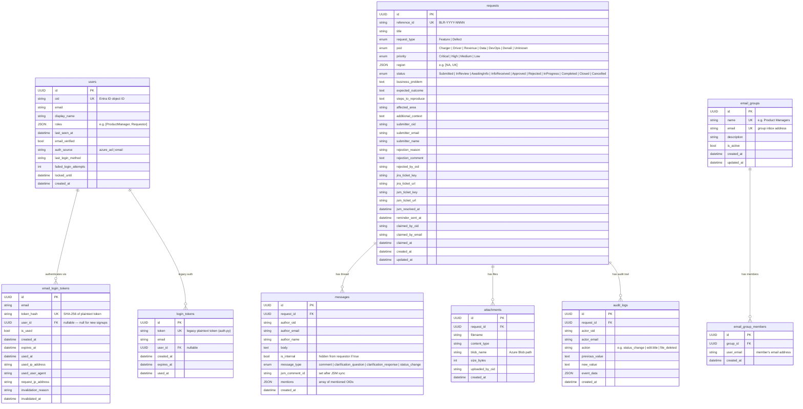

# Blink Relay — Entity Relationship Diagram



## Status State Machine

```
Submitted ──► InReview ──► Approved ──► InProgress ──► Completed ──► Closed
    │              │            │
    │              └──► AwaitingInfo ──► InfoReceived ──► InReview
    │                                                   └──► Approved
    │
    └──► (any state) ──► Cancelled
    └──► Rejected  (terminal)
```

## Key Design Notes

| Concern | Decision |
|---|---|
| Auth | Dual-path: Azure AD (OIDC) or email magic-link. Both upsert into `users`. |
| Token storage | `email_login_tokens` stores SHA-256 hash only — plaintext never persisted. `login_tokens` is a legacy table (plaintext). |
| Soft deletes | None — `attachments`, `messages`, `audit_logs` cascade-delete with the parent `request`. |
| Claim lock | `claimed_by_oid` / `claimed_at` on `requests` — no separate table. |
| PM groups | `email_groups` + `email_group_members` are denormalised by email, not FK to `users`, so group membership survives user account deletion. |
| JSM sync | `jsm_ticket_key` / `jsm_resolved_at` on `requests`; `jsm_comment_id` on `messages` track sync state without a separate join table. |
